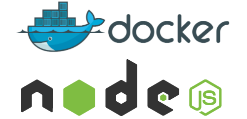

1. Create `Dockerfile`
    ```
    FROM node:7-alpine

    # Create a directory
    RUN mkdir -p /src/app

    # To ensure that a future commands are executed in /src/app
    WORKDIR /src/app

    # Copy from <host_path> to <container_path>
    COPY . /src/app 

    RUN npm install

    EXPOSE 3000

    # will be run when container launch
    CMD npm start

    ```

    `RUN` is an image build step, the state of the container after a RUN command will be committed to the docker image. A Dockerfile can have many RUN steps that layer on top of one another to build the image.

    `CMD` is the command the container executes by default when you launch the built image. A Dockerfile can only have one CMD. The CMD can be overridden when starting a container with docker run $image $other_command. 

2.  Build docker images
    ```
    docker build -t nodejs:v1 .
    ```
    ```
    $ docker images
    REPOSITORY          TAG                 IMAGE ID            CREATED             SIZE
    nodejs              v1                  a365133f2e28        6 seconds ago       67.5MB
    ```
3.  Run container with 80 port
    ```
    $ docker run -d -p 80:3000 --name node-app nodejs:v1
    3dbe413b3a1c00aadbf97a44516562e49df84c688a6b6eb872aa4b161bc678a4
    ```
    ```
    $ docker ps
    CONTAINER ID        IMAGE               COMMAND                  CREATED             STATUS              PORTS                  NAMES
    3dbe413b3a1c        nodejs:v1           "/bin/sh -c 'npm sta…"   28 seconds ago      Up 28 seconds       0.0.0.0:80->3000/tcp   node-app
    ```
