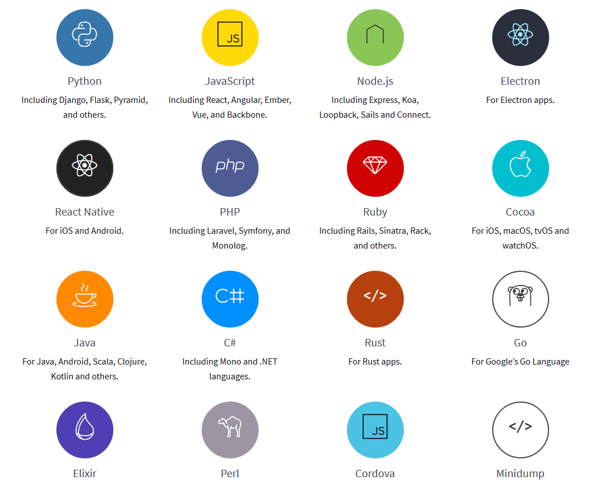

[Sentry](https://github.com/getsentry/sentry) is a an open-source error tracking platform that helps developer to mointor and fix crashes in real time. It supports most popular languages, including but not limited to Java, JavaScript, Node.js, Android, iOS and Python.

## Why do we need Sentry
Common problems after we deploy our service on production environment:
1. We don't know certain function is broken unless the user reports the crash to us actively. If the user don't contact us, we don't know there is a bug.
2. The information shown in error logs are limited, which is hard to find the root cause quickly.
3. Don't have a systematic way to collect and keep track of unresolved bugs.

Here are how Sentry solve these problems:
1. Sentry can capture both frontend and backend erorrs, and send alert to developer team via Slack and email immediately.
2. Sentry can capture additaionl context information when crash happens, such as user's IP Address, broswer used, url visited, button clicked etc. Also provide detailed program stack trace to indicate which lines of code cause the error.
3. Sentry provides differnt programming languages' SDKs that can be integrated into your aplication. Error report can be sent easily using the SDK with a few line of code. Besides, Sentry create a new issue for every crash reported. The issue can be assigned to team members and marked as resolved.

## What platforms do Sentry support
To report error to Sentry, you will need to use a language-specific SDK. Here is a list of supported languages:

|   |  |
|---|---|
| **Languages**  | **Frameworks**  |
|  JavaScript | React, Angular, Angualr 2, Ember, Backbone, Vue, Electron |
|  Node | Express, Koa, Sails and Loopback |
|  Python | markdown table Django, Flask, Tornado, Celery, RQ, Bottle, Pyramid, and Pylons |
|  PHP | Monolog, Laravel, and Symfony |
| Ruby | Rails and Sinatra |
| Go | Integration with the native net/http module |
| Cocoa | Cocoa tvOS, macOS and iOS Objective-C and Swift |
| Java | Android, Log4j, Log4j 2, Logback, Spring and Google App Engine |
| Kotlin | available on Maven |
| Sacala | available on Maven |
| .Net | .NET and C# |
| Perl | available on CPAN |
| Elixir | available via Hex |

To get more details, please visit [SDKs – Sentry Documentation](https://docs.sentry.io/clients/).

## What can Sentry do
Sentry's rich features help you to indentify and debug errors quickly and accurately. The stack trace help you to locate the bug specific to which line of code trigger the error. Breadcrumbs give you insights on how to reproduce the error by recording all the actions performed by the user. Real time notification enable you to get latest alert when error happens. In the following section, more detailed examples will be given.

### Stack Trace
The stack trace shows the sequence of function calls that leading to the error. For JavaScript, usaully it is difficult to debug minified code (e.g. UglifyJS), or transpiled code. Luckily, Sentry supports un-minifying JavaScript via Source Maps. It can let you view the original source code obtained from the stack traces in untransformed form instead of unreadable transformed form.

### Breadcrumbs
 Breadcrumbs show a trail of events that happened prior to the error. It provides rich structured data that can help us to figure out how to reproduce the error. When Sentry is integrated with frontend web framework, breadcrumbs are automatically logged for events like network request and DOM element clikcing history. Apart from these events, you can also manually add new event in your code based on your own business logic. Breadcrumb is belived to be one of the most useful feature apart from stack trace. 

### Tags and Additional Data
By labelling error with different tags, you can determine which errors are coming from a specific server, browser, release, user etc. Each tag can be used as a filter to group errors with the same type together. Moreover, you can also get some insight via seeing the distribution of tags for an issue.

### Notification
Sentry provide differnt notification methods. Apart from email, it supports 3rd party integrations like Slack, HipChat, IRC, Telegram and Whatsapp etc. Sentry allows you to configure per-project alert rules to fully customize notifiation sending. Rules provide several conditions that you are able to configure. For example, you can set a rule to  send a notification every single time an new error happens.

## References
- https://blog.sentry.io/2018/03/06/the-sentry-workflow
- https://docs.sentry.io/

