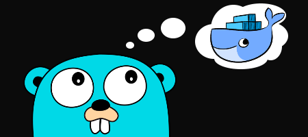

Shipping a Go application to production environment is very easy. You can simply build the application into a executable file and then run on a server. Here, we will go through how to build and run Go application easily using Docker.  

## Setup
We created a simple Go program that simply print out "Hello".

`main.go`
```go
package main

import "fmt"

func main() {
	fmt.Println("Hello")
}
```

## Use Golang Alpine
This is simplest method to build and run Go appliation in Docker using golang:alpine image. 

Here is the `Dockerfile`:
```Dockerfile
FROM golang:1.11-alpine

RUN mkdir /app
COPY  . /app

WORKDIR /app

RUN go build -o main .

CMD ["./main"]

```

```
docker build -t go-docker:v1 .
```
```
docker images

REPOSITORY                    TAG                 IMAGE ID            CREATED             SIZE
go-docker                     v1                  fb385134c202        7 seconds ago       312MB
```

```
docker run --rm go-docker:v1

Hello
```

As you can see, the docker container works fine, but the image size is relatively large for just a Hello world program. 

> SIZE 312MB

Why is it so large? Because inside the go images, it includes Go's dependencies that required during compiling Go application. Howerver, those dependencies are not required after we have compiled it into an executable file.

## Use Docker Multi-stage Build

Here is the introduction of multi-stage build extract from Docker official documentation:

> With multi-stage builds, you use multiple FROM statements in your Dockerfile. Each FROM instruction can use a different base, and each of them begins a new stage of the build. You can selectively copy artifacts from one stage to another, leaving behind everything you don’t want in the final image. 
> https://docs.docker.com/develop/develop-images/multistage-build/

By default, the stage is not named. We can name a stage by using `as <NAME>` after the `FROM` statement.

```Dockerfile
# Build stage
FROM golang:1.11-alpine as builder

RUN mkdir /app
COPY  . /app

WORKDIR /app

RUN go build -o main .

# Run stage
FROM alpine:3.8

WORKDIR /root

COPY --from=builder /app/main .

CMD ["./main"]
```

```
docker build -t go-docker:v2 .
```

```
 docker images
 
REPOSITORY                    TAG                 IMAGE ID            CREATED             SIZE
go-docker                     v2                  39c4ccb73334        18 seconds ago      6.32MB
<none>                        <none>              d874ce40221b        20 seconds ago      312MB
go-docker                     v1                  fb385134c202        13 minutes ago      312MB
```

```
docker run --rm go-docker:v2

Hello
```

## Run with Scratch Image
```
 docker build -t go-docker:v3 .
```
```
docker images
 
REPOSITORY                    TAG                 IMAGE ID            CREATED             SIZE
go-docker                     v3                  74a17e53882d        7 seconds ago       1.9MB
<none>                        <none>              9d2c2b165875        7 seconds ago       312MB
go-docker                     v2                  39c4ccb73334        24 minutes ago      6.32MB
<none>                        <none>              d874ce40221b        25 minutes ago      312MB
go-docker                     v1                  fb385134c202        37 minutes ago      312MB
```
```
docker run --rm go-docker:v3

Hello
```

## Clean Up Dangling Docker Images

In multi-stage build, each stage produces an images. So when you run `docker images`, you will see some dangling images like this:

```
<none>                        <none>              d874ce40221b        25 minutes ago      312MB
```

One possible way to remove them once at all is to run:
```
docker image prune

WARNING! This will remove all dangling images.
Are you sure you want to continue? [y/N] y
Deleted Images:
deleted: sha256:9d2c2b16587512fc8a7f9d8ad9019fee65e6fbaf0f8661501eaf858c424781d4
...
```

That's all for shipping a simple Go application with Docker. In later tutorial, we will ship Go Web Application with other Go libraries using Docker. 

Reference:
[The Ultimate Guide to Writing Dockerfiles for Go Web-apps](https://blog.hasura.io/the-ultimate-guide-to-writing-dockerfiles-for-go-web-apps-336efad7012c)

Full soruce code available here: [Github](https://github.com/opw0011/go-playground/tree/master/go-docker)
