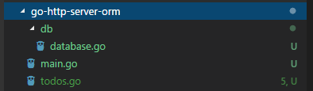

This tutorial is continuos to previous Go Restful API tutoiral. We are going to look at how to use [Gorm](https://github.com/jinzhu/gorm) to persist our data instead of storing in memory.

To install gorm, run `go get -u github.com/jinzhu/gorm`.

## Create database connection

The first step is to create another package `db` to act as a global database interface so that we dont't have to open database connection everytime.

`go-http-server-orm/db/database.go`
```go
package db

import (
	"github.com/jinzhu/gorm"
	_ "github.com/jinzhu/gorm/dialects/sqlite"
)

var DB *gorm.DB

func Open() {
	var err error
	DB, err = gorm.Open("sqlite3", "test.db")
	if err != nil {
		panic("failed to connect database")
	}
}

func Close() {
	err := DB.Close()
	if err != nil {
		panic("Cannot close db")
	}
}

```
Our folder structure looks like this:



## Open database connection

In `main.go`, import the `db` package

```go
import (
  // skips
	"playground/go-http-server-orm/db"
)
```

And then using `db.DB.AutoMigrate` to migrate our db schemas, and `db.Open()` function to open db connection.
```go
// initail db migration
func initMigration() {
	db.DB.AutoMigrate(&Todo{})
}

func main() {
	fmt.Println("The server starts")

	db.Open()
	defer db.Close()

	initMigration()

	handleRequests()
}

```
Note that the the `db.Open()` is long running thread just like the APIs. It must be put in the main thread, otherwise the db connection lost once the thread get killed.

## CRUD operations on db

In `todos.go`, replace previous in-memory CRUD with gorm high-level database operations.

```go
func ListTodos(w http.ResponseWriter, r *http.Request) {
	var todos []Todo
	db.DB.Find(&todos)
	json.NewEncoder(w).Encode(todos)
}

func AddTodo(w http.ResponseWriter, r *http.Request) {
	rTodo := decodeJSONRequest(r)
	newTodo := Todo{Title: rTodo.Title, Content: rTodo.Content}
	db.DB.Create(&newTodo)
	json.NewEncoder(w).Encode(newTodo)
}

func UpdateTodo(w http.ResponseWriter, r *http.Request) {
	vars := mux.Vars(r)
	id, err := strconv.ParseUint(vars["id"], 10, 32)
	if err != nil {
		panic(err)
	}

	rTodo := decodeJSONRequest(r)

	var updatedTodo Todo
	db.DB.First(&updatedTodo, uint(id))

	if &updatedTodo != nil {
		updatedTodo.Content = rTodo.Content
		updatedTodo.Title = rTodo.Title
		db.DB.Save(&updatedTodo)
	}

	json.NewEncoder(w).Encode(updatedTodo)
}

func DeleteTodo(w http.ResponseWriter, r *http.Request) {
	vars := mux.Vars(r)
	id, err := strconv.ParseUint(vars["id"], 10, 32)
	if err != nil {
		panic(err)
	}

	var deletedTodo Todo
	db.DB.First(&deletedTodo, uint(id))
	db.DB.Delete(deletedTodo)

	json.NewEncoder(w).Encode(deletedTodo)
}
```

## Test the API

```sh
go run .\main.go .\todos.go
```

```
curl localhost:3000/todos -X 'POST' -d '{"title": "t1", "content": "c1"}'
{"id":1,"title":"t1","content":"c1"}

curl localhost:3000/todos -X 'POST' -d '{"title": "t2", "content": "c2"}'
{"id":2,"title":"t2","content":"c2"}

curl localhost:3000/todos -X 'GET'
[{"id":1,"title":"t1","content":"c1"},{"id":2,"title":"t2","content":"c2"}]

curl localhost:3000/todos/2 -X 'PUT' -d '{"title": "tt2", "content": "cc2"}'
{"id":2,"title":"tt2","content":"cc2"}

curl localhost:3000/todos -X 'GET'
[{"id":1,"title":"t1","content":"c1"},{"id":2,"title":"tt2","content":"cc2"}]

curl localhost:3000/todos/1 -X 'DELETE'
{"id":1,"title":"t1","content":"c1"}

curl localhost:3000/todos -X 'GET'
[{"id":2,"title":"tt2","content":"cc2"}]
```

Now we restart the program

```
curl localhost:3000/todos -X 'GET'
[{"id":2,"title":"tt2","content":"cc2"}]
```

You can see the data is still here! So we have succesully saved our data into sqlite db.

## Complete code

`main.go`

```go
package main

import (
	"fmt"
	"log"
	"net/http"
	"playground/go-http-server-orm/db"

	"github.com/gorilla/mux"
)

func index(w http.ResponseWriter, r *http.Request) {
	fmt.Fprint(w, "Index page")
}

// handle all the http requests
func handleRequests() {
	router := mux.NewRouter()

	router.HandleFunc("/", index).Methods("GET")

	// GET, POST, PUT, DELETE
	router.HandleFunc("/todos", ListTodos).Methods("GET")
	router.HandleFunc("/todos", AddTodo).Methods("POST")
	router.HandleFunc("/todos/{id:[0-9]+}", UpdateTodo).Methods("PUT")
	router.HandleFunc("/todos/{id:[0-9]+}", DeleteTodo).Methods("DELETE")

	log.Fatal(http.ListenAndServe("localhost:3000", router))
}

// initail db migration
func initMigration() {
	db.DB.AutoMigrate(&Todo{})
}

func main() {
	fmt.Println("The server starts")

	db.Open()
	defer db.Close()

	initMigration()

	handleRequests()
}

```

`db/databse.go`
```go
package db

import (
	"github.com/jinzhu/gorm"
	_ "github.com/jinzhu/gorm/dialects/sqlite"
)

var DB *gorm.DB

func Open() {
	var err error
	DB, err = gorm.Open("sqlite3", "test.db")
	if err != nil {
		panic("failed to connect database")
	}
}

func Close() {
	err := DB.Close()
	if err != nil {
		panic("Cannot close db")
	}
}

```

`todo.go`

```go
package main

import (
	"encoding/json"
	"net/http"
	"playground/go-http-server-orm/db"
	"strconv"

	"github.com/gorilla/mux"
)

type Todo struct {
	ID      uint   `json:"id"`
	Title   string `json:"title"`
	Content string `json:"content"`
}

func ListTodos(w http.ResponseWriter, r *http.Request) {
	var todos []Todo
	db.DB.Find(&todos)
	json.NewEncoder(w).Encode(todos)
}

func AddTodo(w http.ResponseWriter, r *http.Request) {
	rTodo := decodeJSONRequest(r)
	newTodo := Todo{Title: rTodo.Title, Content: rTodo.Content}
	db.DB.Create(&newTodo)
	json.NewEncoder(w).Encode(newTodo)
}

func UpdateTodo(w http.ResponseWriter, r *http.Request) {
	vars := mux.Vars(r)
	id, err := strconv.ParseUint(vars["id"], 10, 32)
	if err != nil {
		panic(err)
	}

	rTodo := decodeJSONRequest(r)

	var updatedTodo Todo
	db.DB.First(&updatedTodo, uint(id))

	if &updatedTodo != nil {
		updatedTodo.Content = rTodo.Content
		updatedTodo.Title = rTodo.Title
		db.DB.Save(&updatedTodo)
	}

	json.NewEncoder(w).Encode(updatedTodo)
}

func DeleteTodo(w http.ResponseWriter, r *http.Request) {
	vars := mux.Vars(r)
	id, err := strconv.ParseUint(vars["id"], 10, 32)
	if err != nil {
		panic(err)
	}

	var deletedTodo Todo
	db.DB.First(&deletedTodo, uint(id))
	db.DB.Delete(deletedTodo)

	json.NewEncoder(w).Encode(deletedTodo)
}

func decodeJSONRequest(r *http.Request) Todo {
	decoder := json.NewDecoder(r.Body)
	var rTodo Todo
	err := decoder.Decode(&rTodo)
	if err != nil {
		panic(err)
	}
	return rTodo
}

```
